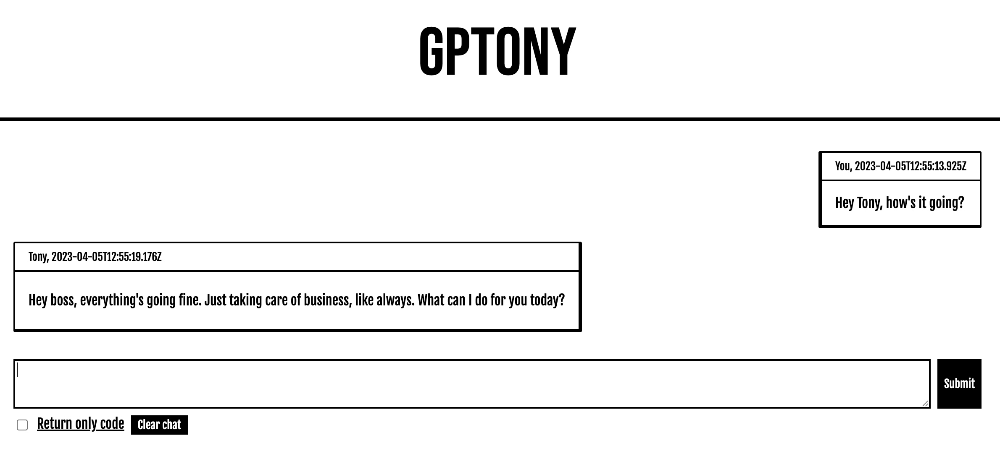

# GPTony

A simple web wrapper for the chatGPT completion API. It should be live, here:

https://gptony.netlify.app/

## Why

This is a hobby project, and an experiment with using chatGPT API to configure a local specialised chatbot.

GPTony is best used as an assistance to software development, a slightly specialised UI to help with coding.

## Disclaimer

To use this app, you will need an active API key, which has billing enabled. Before using, please read through the [pricing section on openai.com](https://openai.com/pricing).

Currently GPTony supports two models:

- gpt-4
- gpt-3.5-turbo

Read more about the different models [here](https://platform.openai.com/docs/models/overview).

Finally, the application <b>will</b> expose you API key in a request header, when making requests. Use at your own risk.

## Known issues

- Mobile styling is shit. I would not recommend using on mobile
- Header contraction/expansion might be broken on certain layouts and screen sizes
- Responses with code samples might be too wide to render correctly on smaller screen widths, depending on the content
